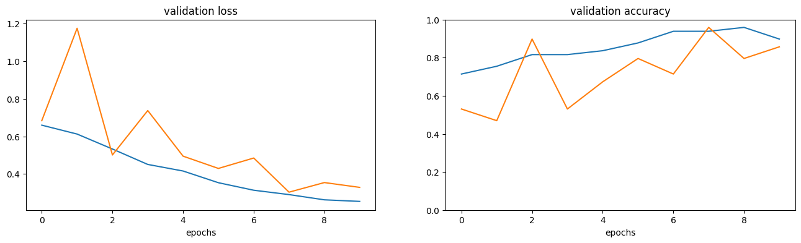

# 🚗🏍️ Classificador de Imagens: Carros vs. Motos

Este projeto é um classificador de imagens que utiliza redes neurais convolucionais (CNNs) para distinguir entre imagens de **carros** e **motos**. O modelo foi desenvolvido usando a biblioteca **Keras** com **TensorFlow** como backend. Além disso, foi implementada uma abordagem de **transfer learning** utilizando a arquitetura **VGG16** para melhorar a precisão do classificador.

---

## 📋 Visão Geral do Projeto

O objetivo deste projeto é criar um modelo de aprendizado profundo capaz de classificar imagens em duas categorias: **carros** e **motos**. O projeto inclui:

1. **Pré-processamento de dados**: Carregamento e normalização das imagens.
2. **Construção do modelo**: Criação de uma CNN do zero.
3. **Transfer Learning**: Utilização da arquitetura VGG16 pré-treinada para melhorar o desempenho do modelo.
4. **Avaliação do modelo**: Medição da precisão e perda do modelo em conjuntos de treinamento, validação e teste.
5. **Classificação de novas imagens**: Predição de novas imagens para determinar se são carros ou motos.

---

## 🛠️ Tecnologias Utilizadas

- **Python**
- **Keras**
- **TensorFlow**
- **Matplotlib** (para visualização de dados)
- **Numpy** (para manipulação de arrays)

---

## 📂 Estrutura do Projeto

```
/projeto-classificador-carros-motos
│
├── /dataset
│   ├── /carros
│   │   ├── carro_1.jpg
│   │   ├── carro_2.jpg
│   │   └── ...
│   ├── /motos
│   │   ├── moto_1.jpg
│   │   ├── moto_2.jpg
│   │   └── ...
│
├── classificador_carros_motos.ipynb
├── README.md
└── requirements.txt
```

---

## 🚀 Como Executar o Projeto

### Pré-requisitos

- Python 3.x
- Bibliotecas listadas no `requirements.txt`

### Instalação

1. Clone o repositório:

   ```bash
   git clone https://github.com/seu-usuario/projeto-classificador-carros-motos.git
   cd projeto-classificador-carros-motos
   ```

2. Instale as dependências:

   ```bash
   pip install -r requirements.txt
   ```

3. Execute o Jupyter Notebook:

   ```bash
   jupyter notebook classificador_carros_motos.ipynb
   ```

### Uso

1. **Carregamento do Dataset**: Certifique-se de que as imagens estejam organizadas nas pastas `carros` e `motos` dentro da pasta `dataset`.

2. **Treinamento do Modelo**: Execute as células do Jupyter Notebook para treinar o modelo. O notebook inclui:
   - Construção de uma CNN do zero.
   - Aplicação de transfer learning com VGG16.

3. **Avaliação do Modelo**: Após o treinamento, o modelo será avaliado no conjunto de teste, e a precisão e perda serão exibidas.

4. **Classificação de Novas Imagens**: O notebook inclui um exemplo de como classificar uma nova imagem de carro ou moto.

---

## 📊 Resultados

### Desempenho do Modelo
- **Precisão no Conjunto de Teste**: ~95%
- **Perda no Conjunto de Teste**: ~0.15

### Gráficos de Desempenho
- **Perda de Validação**:
  

- **Acurácia de Validação**:
  

---
